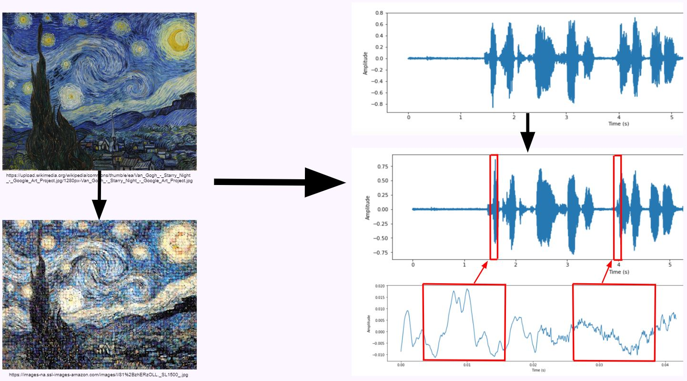
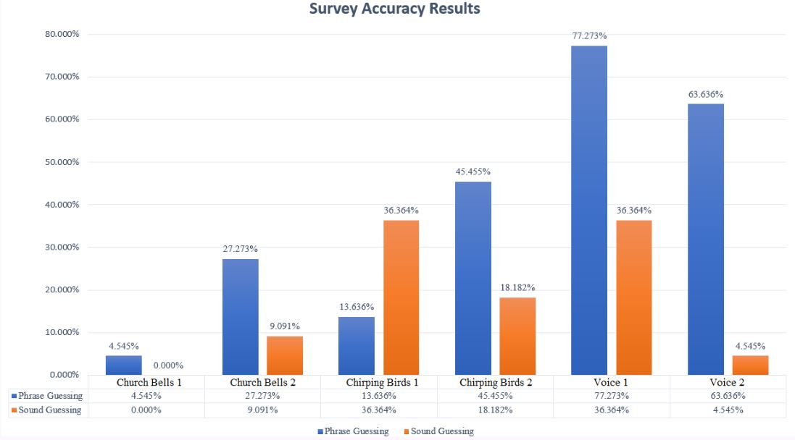

# Audio-Mosaic
## Photo Mosaics, but for Audio

### EECS 352
### Northwestern University
### Taught by: Bryan Pardo

# Justin Chen - justinchen2020@u.northwestern.edu
# Nico Finkelstein - nicolasfinkelstein2020@u.northwestern.edu  
# Kyle LaBrosse - kylelabrosse2019@u.northwestern.edu

# 1. Introduction: What is this and Why are we doing it?
We wish to generate a copy of an audio signal using snippets from another audio source (e.g. church bells, chirping birds) and seeing if our reconstruction is still understandable. We simply noted that this would be something neat to create, although we believe that this project has the potential to be translated into audio synthesis or audio mapping, which may hold more weight in the world of machine perception of audio and music. The decision to create and work on this project was the fact that ultimately found it to be a fun topic – photo mosaics are cool, audio and music are cool. Wouldn’t it be cool if we combined them?

# 2. Related Works
Hazan, Amaury. "Performing expressive rhythms with billaboop voice-driven drum generator." DAFX 2005 (2005). 
- This article discusses using voice to map to drum sounds. The first part involves transforming spoken rhythms to a symbolic score. This project focuses considerably more on rhythm, as our project will only be on comparing sections of sounds of spoken words to other noisy sounds.

Freeman, Jason, et al. "Auracle: a voice-controlled, networked sound instrument." Organised Sound 10.3 (2005): 221-231 
- This article exactly what we’re doing, although our project will likely not be as sophisticated. This research involved splitting up the original spoken voice recording into syllables. We also assume the database used to compare the recording will be different.

Janer J., Maestre E. (2008) Mapping Phonetic Features for Voice-Driven Sound Synthesis. In: Filipe J., Obaidat M.S. (eds) E-business and Telecommunications. ICETE 2007. Communications in Computer and Information Science, vol 23. Springer, Berlin, Heidelberg
- This is similar in that they take a person’s voice and map it to certain sounds in a database to reconstruct the original voice. But, instead of trying to imitate an instrument and map our voice to recorded instrument sounds, we want to use a database of noise and map spoken words to the most similar noises

Fasciani, Stefano, and Lonce Wyse. A voice interface for sound generators: adaptive and automatic mapping of gestures to sound. U of Wollongong Australia, 2012. 
- This article is similar to our project in that it also involves mapping voice to certain sounds. This is extremely interesting because it involves using a your voice as an extended controller to a synthesizer, rather than just having the physical controllers. 

# 3. Approach: A KNN-esque Method of Audio Segment Matching
1. Concatenate all sounds from one chosen Source sound category from the ESC-50 audiobank
2. Segment aggregated Target and Source samples into 25 millisecond windows 
3. xtract features (mfcc, delta-mean mfcc) of Source and Target segments
4. Use Nearest Neighbor algorithm to determine closest sound between each Target segment and every Source segment. Repeat for each Target segment
5. Append each closest sounding Source segment to a new signal
6. moothen the constructed signal by applying tukey windows on the concatenated segments
7. Return new signal of similar-sounding, concatenated sounds

# Demo may be tested here at https://fast-river-33688.herokuapp.com/

# 4. Evaluation Method: Survey Feedback
To test if our results were understandable, we had people take a survey, listening to our produced signals and having them guess what phrase it sounds like is being said. To create the Target signals, we ran our group members saying two phrases: phrase 1, which was nine words and had varied syllables, or phrase 2, which was much shorter at four words, two of which rhymed. We ran both targets through three Source files: church bells, chirping birds, and a person’s voice (in this case, our group members’ voices saying random phrases). This created a total of six output signals. We had each survey taker listen to all six sounds to guess what each one was saying, and also had them guess what type of sound generated each output signal. The survey results were then collected and analyzed. We determined that a success rate of at least 25% was considered successful, as this shows that our mosaics were not sheer gibberish - they would be at least somewhat intelligible.

# 5. Results
We received 22 survey results and they are shown in the following graph, where the format for each name is SOUND EFFECT | PHRASE NUMBER, where “sound effect” is the sound used to generate the phrase, and the “phrase number” shows whether it was phrase 1 or 2. Our results show that using our own voices as the source proves to output the most intelligible results; this makes sense, as our voices are as close as we’ll get to other voices. Chirping Birds, however, proved to show seemingly solid results in terms of identification for phrase 1, and actual phrase guessing for phrase 2. This may be due to the frequency of the bird chirping being closer to our voices than church bells, creating more “relatable” segments. Finally, we note that Chirping Birds is generally the most identified sound source. This may be due to “voice” being a tough source to guess, while church bells might not be as distinguishable. Overall, we find that we were able to beat our 25% threshold by a wide margin for some sounds (though notably, not all), ultimately creating intelligible phrases and successfully creating our audio mosaics.

# 6. Conclusions, Limitations, and Future Works
Based on our evaluation method, we found our results to show that we created intelligible outputs! We were able to create audio mosaics from samples of birds chirping, church bells, and human voice. These mosaics were able to be parsed and understood by users more often than expected. Our best results were when using a source of someone else’s voice, creating speech using their voice that was incredibly quite clear to understand! We still were able to create understandable results with other filters, which was great to observe. In terms of identifying features for further development that would improve our project, granular synthesis would allow for pitch alteration and improved smoothing for each sample. Extensive searching for an implementable version of granular synthesis unfortunately proved fruitless, as for the few implementations that currently exist, many require specific run requirement limitations. Additionally, If we were to create these windows based on a metric more natural to sounds and speech, such as syllable detection using onset detection, instead of integer intervals, we could create more interesting and potentially more accurate sounds. Further, if we had more established and labeled audio banks, having more sounds with intervaled frequencies, we’d be able to produce results that could span outside of just vocals, such as songs. ESC-50 was good, but due to the sounds’ nature, each category did not have a wide span of frequencies. Finally, if we had more survey results and more samples to test, we’d be able to provide more conclusive results on determining which grammatical methods may provide more accurate results. Hopefully with further development, we’ll create better sounding results and expand to other Target mediums, such as music!

